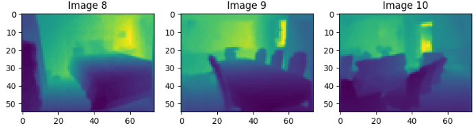

#  Monocular Depth Estimation

This project implements a deep learning model for **depth estimation from a single RGB image** (monocular). The model is trained to predict a depth map from a given 2D image using convolutional neural networks (CNNs).


## Features

- Predicts depth maps from monocular RGB images.
- CNN-based architecture with encoder-decoder structure.
- Built using **Keras** with TensorFlow backend.
- Supports loading and visualizing sample test images and their depth maps.

## Setup 

1. **Clone the Repository**
   ```bash
   git clone https://github.com/nervin3/monocular-Depth-Estimation.git
   cd monocular-Depth-Estimation
   ```

2. **Install Dependencies**
   ```bash
   pip install tensorflow keras numpy matplotlib opencv-python
   ```

3. **Run the Notebook**
   Open `MDE_model.ipynb` in Jupyter:
   ```bash
   jupyter notebook MDE_model.ipynb
   ```

##  Model Overview

The model uses a convolutional encoder-decoder architecture to extract image features and reconstruct a dense depth map.

- **Input**: RGB image
- **Output**: 1-channel depth map
- **Loss Function**: MSE (Mean Squared Error)
- **Evaluation Metrics**: Visual inspection, RMSE

##  Sample Output

 

